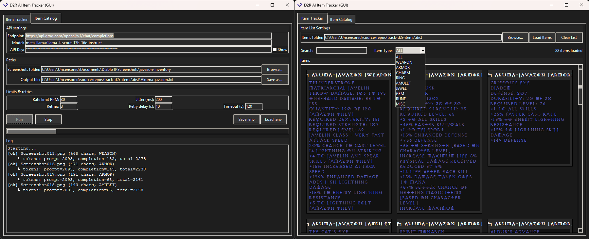

# D2R AI Item Tracker (GUI)



Batch-extract **Diablo II: Resurrected** item tooltips from screenshots using a **Vision LLM** via an **OpenAI-compatible API** (e.g., Groq, OpenAI, OpenRouter, LM Studio/Ollama OpenAI bridge).

## Features

- **Batch Processing**: Process hundreds of item screenshots automatically
- **Smart OCR**: Uses AI vision models to accurately read item tooltips
- **Clean Output**: Removes UI elements like "Ctrl + Left Click to Move" and set item lists
- **Item Categorization**: Automatically categorizes items (WEAPON, ARMOR, RING, etc.)
- **Searchable Database**: Browse and filter your entire item collection
- **Persistent Cache**: Your item lists are saved between app sessions

---

## How It Works

### Item Tracker Tab
1. **Point to Screenshots**: Select your D2R screenshots folder
2. **Configure API**: Set up your vision AI service (Groq recommended - it's free!)
3. **Batch Process**: The AI reads each screenshot and extracts the item text
4. **Clean Results**: Automatically removes UI clutter and formats the output
5. **Save to File**: All items saved to a single text file, separated by `---`

### Item Catalog Tab  
1. **Load Items**: Import your processed item text files
2. **Smart Search**: Find items by name, stats, or character name
3. **Category Filter**: Filter by item type (weapons, armor, charms, etc.)

**See the [`examples/` folder](https://github.com/vdamov/D2R-AI-Item-Tracker/tree/main/example)** for sample screenshots and their expected output format.

---

## Download & Run (Windows)

1. **Get the EXE**
   - Open the repository's [**Releases**](https://github.com/vdamov/D2R-AI-Item-Tracker/releases) page on GitHub
   - Download **`D2R-AI-Item-Tracker.exe`** from the latest release (Assets section)

2. **Run the App**
   - Double-click `D2R-AI-Item-Tracker.exe`
   - In the **Item Tracker** tab, fill in:
     - **Endpoint** – OpenAI-compatible chat-completions URL  
       (e.g., `https://api.groq.com/openai/v1/chat/completions`)
     - **Model** – vision-capable model id  
       (e.g., `meta-llama/llama-4-scout-17b-16e-instruct`)
     - **API Key** – your API key
     - **Screenshots folder** – your D2R screenshots directory
     - **Output file** – where to save results (defaults to `output.txt`)
   - Click **Run**. The log shows progress as each screenshot is processed
   
3. **Browse Items**
   - Switch to the **Item List** tab
   - Choose a folder containing your `.txt` exports (where `output.txt` is saved)
   - Click **Load Items**
   - Use the **Search** box and **Item Type** dropdown to filter your collection

> **Tip**: Use **File → Save .env** to store your settings for next time. Use **File → Load .env** to restore them.

---

## Groq Setup (Free API - No Payment Method Needed)

Groq provides **free access** to hosted LLaMA vision models without requiring a credit card.

### Get Your Free API Key:
1. Go to **[https://console.groq.com](https://console.groq.com)**
2. Sign in with a **Google account** 
3. Open **API Keys** in the left menu
4. Click **Create API Key** → Copy your `gsk_...` token

### App Configuration:
- **Endpoint**: `https://api.groq.com/openai/v1/chat/completions`
- **Model**: `meta-llama/llama-4-scout-17b-16e-instruct`  
- **API Key**: Your `gsk_...` key

That's it! No billing setup required. If you hit rate limits, just wait a bit and retry.

---

## Item Categories & Search

The AI automatically categorizes items into these types:

| Category | Examples |
|----------|----------|
| **WEAPON** | Swords, bows, axes, wands, orbs |
| **ARMOR** | Helms, armor, boots, gloves, belts, shields |
| **RING** | All rings |
| **AMULET** | All amulets |
| **JEWEL** | Socketable jewels |
| **CHARM** | Small, large, grand charms |
| **GEM** | Ruby, emerald, sapphire, topaz, amethyst, diamond, skull |
| **RUNE** | El through Zod (all 33 runes) |
| **RUNEWORD** | Enigma, Infinity, Spirit, etc. |
| **MISC** | Potions, scrolls, quest items |

### Search Examples:
- `"fire resist"` → Find all items with fire resistance
- `"shako"` → Find Harlequin Crest
- `"+skills"` → Find items with +skill modifiers
- Filter by **WEAPON** + search `"bow"` → Find all bows

---

## File Structure

```
📁 Your D2R Screenshots/
├── Screenshot001.png    ← Item tooltips
├── Screenshot002.png    
└── output.txt          ← Generated results

📁 examples/
├── screenshots/        ← Sample item screenshots  
└── output/Akuma-javazon.txt ← What the AI should produce
```

**Output Format** (output.txt):
```
PLAGUE FINGER
CHAIN GLOVES
DEFENSE: 16
DURABILITY: 16 OF 16
REQUIRED STRENGTH: 25
REQUIRED LEVEL: 72
+2 TO JAVELIN AND SPEAR SKILLS (AMAZON ONLY)
+20% INCREASED ATTACK SPEED
+63% ENHANCED DEFENSE
HALF FREEZE DURATION
LEVEL 1 POISON NOVA (22/22 CHARGES)
[CATEGORY: ARMOR]
---
RUBY GRAND CHARM OF LIFE
REQUIRED LEVEL: 22
+11 TO LIFE
FIRE RESIST +2%
[CATEGORY: CHARM]
```

---

## Supported APIs

Any **OpenAI-compatible** vision API will work:

| Provider | Endpoint | Free Tier |
|----------|----------|-----------|
| **Groq** | `api.groq.com/openai/v1/chat/completions` | ✅ No credit card |
| **OpenAI** | `api.openai.com/v1/chat/completions` | ❌ Requires billing |
| **OpenRouter** | `openrouter.ai/api/v1/chat/completions` | ⚠️ Free credits |
| **Ollama** | `localhost:11434/v1/chat/completions` | ✅ Local models |
| **LM Studio** | `localhost:1234/v1/chat/completions` | ✅ Local models |

---

## Troubleshooting

### Windows Defender Issues
**Windows Controlled Folder Access** may block saving in protected folders (Documents, Desktop).

**Solutions:**
- Choose a different output folder (e.g., Downloads)
- Allow the app: **Windows Security → Ransomware Protection → Allow an app through Controlled folder access**
- The app auto-fallbacks to: `%LOCALAPPDATA%\D2R-AI-Item-Tracker\`

### Rate Limiting  
Keep **Rate Limit RPM** reasonable (e.g., 30) and **Jitter** > 0 to avoid 429 errors.

### Missing Items Cache
Items are automatically cached in `%LOCALAPPDATA%\D2R-AI-Item-Tracker\`. Use **Clear List** to reset.

### Common Issues
- **"No images found"** → Check screenshots folder path
- **"API key missing"** → Verify your API key is correct
- **"2 chars output"** → AI couldn't read the screenshot, try different images

---

## Building from Source

### Requirements
- Python 3.9+
- pip install: `opencv-python numpy requests Pillow python-dotenv`

### Build EXE
```bash
git clone https://github.com/vdamov/D2R-AI-Item-Tracker.git
cd D2R-AI-Item-Tracker
pip install -r requirements.txt
pyinstaller --onefile --hidden-import=tkinter --name "D2R-AI-Item-Tracker" --icon=assets/images/icon.ico --add-data "assets/fonts;assets/fonts" --add-data "assets/images/icon-color.ico;images" main.py
```

### GitHub Actions
The repository includes automated EXE building via GitHub Actions. Each release automatically generates the Windows executable.

---

## Tips for Best Results

### Screenshot Tips
- **High resolution**: 1080p+ screenshots work best
- **Full tooltip visible**: Make sure item tooltip is completely shown
- **Good contrast**: Dark background, bright tooltip text
- **No overlapping**: Avoid overlapping windows or UI elements

### Batch Processing Tips  
- **Organize by character**: Use separate folders for each character's items
- **Remove duplicates**: Delete blurry or duplicate screenshots first
- **Use meaningful names**: Name output files by character (e.g., `javazon_items.txt`)

### Search Tips
- **Use quotes**: `"faster cast rate"` for exact phrases
- **Combine filters**: Set category to WEAPON then search for specific weapon types
- **Character names**: Search by character name to find items from specific heroes

---

## License

MIT License © 2025 Vladimir Damov

---

## Contributing

Pull requests welcome! Please see the `examples/` folder for expected input/output formats when testing changes.