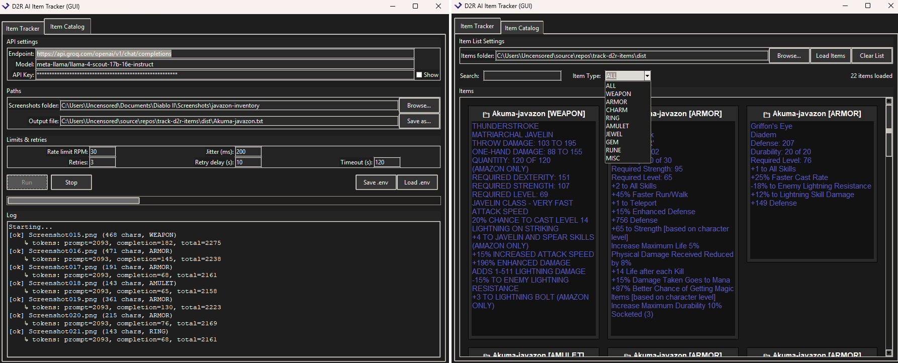

# D2R AI Item Tracker (GUI)

Batch-extract **Diablo II: Resurrected** item tooltips from screenshots using a **Vision LLM** via an **OpenAI-compatible API** (e.g., Groq, OpenAI, OpenRouter, LM Studio/Ollama OpenAI bridge).

* Cleans common footer lines (e.g., “Ctrl + Left Click to Move”, “Hold Shift to Compare”).
* Skips the “other set items” list on set items.
* Saves all results to a single `output.txt` (items separated by `---`).
* **Item List** tab lets you **filter by Search** and **Category** (WEAPON/ARMOR/CHARM/etc.) for quick browsing.

---

## Download & Run (Windows)

1. **Get the EXE**

   * Open the repository’s [**Releases**](https://github.com/vdamov/D2R-AI-Item-Tracker/releases) page on GitHub.
   * Download **`D2R AI Item Tracker.exe`** from the latest release (Assets section).

2. **Run the App**

   * Double-click `D2R AI Item Tracker.exe`.

   * In the **Item Tracker** tab, fill in:

     * **Endpoint** – OpenAI-compatible chat-completions URL
       (e.g., `https://api.groq.com/openai/v1/chat/completions`)
     * **Model** – vision-capable model id
       (e.g., `meta-llama/llama-4-scout-17b-16e-instruct`)
     * **API Key** – your API key
     * **Screenshots folder** – your D2R screenshots directory
     * **Output file** – where to save results (defaults to `output.txt` in the chosen folder)

   * Click **Run**. The log shows progress; the app writes all parsed tooltips to `output.txt`.

3. **Browse Items**

   * Switch to the **Item List** tab.
   * Choose a folder containing your `.txt` exports (e.g., where `output.txt` is).
   * Click **Load Items**.
   * Use the **Search** box and **Item Type (Category)** dropdown to filter.

> Tip: Use **File → Save .env** to store your settings for next time. Use **File → Load .env** to restore them.

---

## Groq Is Free (No Payment Method Needed)

Groq provides **free access** to hosted LLaMA vision models — and you **do not need to add a payment method**.

To get a free API key:

1. Go to **[https://console.groq.com](https://console.groq.com)**
2. Sign in with a **Google account** (only login option right now).
3. Open **API Keys** in the left menu.
4. Click **Create Key**. You’ll get a token starting with `gsk_...`.
5. In the app, set:

   * **Endpoint**: `https://api.groq.com/openai/v1/chat/completions`
   * **Model**: `meta-llama/llama-4-scout-17b-16e-instruct`
   * **API Key**: your `gsk_...` key

That’s it — no billing setup required. If you hit rate limits, just wait a bit and retry.

---

## Notes & Troubleshooting

* **Windows Defender Controlled Folder Access** may block saving in protected folders (e.g., Documents).

  * Choose a different output folder, or
  * Allow the app in **Windows Security → Ransomware protection → Allow an app through Controlled folder access**.
  * The app also attempts a fallback:
    `%LOCALAPPDATA%\D2R-AI-Item-Tracker\output.txt`

* Keep **Rate Limit RPM** reasonable (e.g., 30) and **Jitter** > 0 to avoid 429 errors.

---

## License

MIT License © 2025 Vladimir Damov
